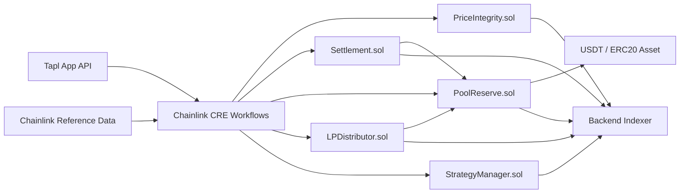
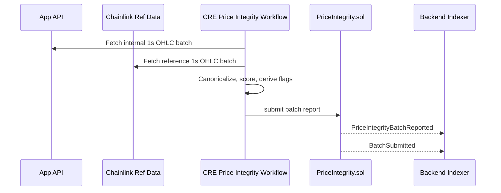
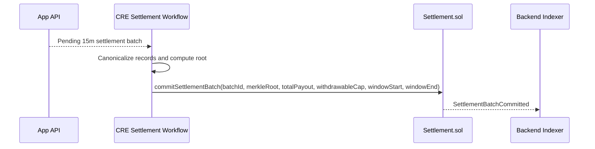

# Tapl x Chainlink

Smart contract and Chainlink Runtime Environment infrastructure for the Tapl BTC tap-trading proof of concept.

This repository does not contain the app frontend or backend. Its scope is:
- EVM smart contracts for onchain verification, settlement batching, solvency reporting, LP reserve management, and strategy updates
- 5 Chainlink CRE workflows that read app API data and write reports/actions onchain

## Progress Snapshot

### Product Capability Status

| Domain | Feature | Status | Notes |
|---|---|---|---|
| Contracts | Price integrity reporting | Done | 15m batch compare, pass/fail flags, hashes, report storage |
| Contracts | Settlement batch commitment | Done | `commitSettlementBatch(...)` stores batch metadata |
| Contracts | Pool reserve vault | Done | LP deposit/withdraw, trader deposit/claim, solvency reporting |
| Contracts | Strategy parameter management | Done | Volatility regime updates onchain |
| CRE | Price integrity workflow | Done | 15m cron, app API + Chainlink reference compare |
| CRE | Settlement workflow | Done | 15m cron, app API batch -> onchain commit |
| CRE | Pool solvency workflow | Done | daily cron, app API liability + onchain balance read |
| CRE | Strategy rebalance workflow | Done | HTTP trigger, app API state + regime payload |

### Engineering Maturity Status

| Area | Status | Notes |
|---|---|---|
| Smart contract scope | Hackathon PoC | Deliberately minimal, optimized for speed of delivery |
| CRE workflow scope | Hackathon PoC | Deterministic and idempotent, but app API driven |
| Test coverage | Good for PoC | Foundry + Bun tests present in each subproject |
| Security posture | PoC | Trusted app API / CRE assumptions remain |
| Production readiness | Not targeted | Mocked CCIP, simplified trader accounting, no upgrade path |

## Architecture Overview

- App backend owns gameplay, batching, and offchain business state.
- CRE workflows consume app API payloads on schedule or by HTTP trigger.
- CRE signs and submits reports/actions into Tapl consumer contracts.
- Contracts emit canonical events for backend indexing and audit.



## Core Architecture Flows

### 1. Price Integrity Flow

CRE runs every 15 minutes, fetches the last closed 15-minute OHLC window from the app API and Chainlink-aligned reference data, computes metrics and score offchain, then writes the result to `PriceIntegrity.sol`.



### 2. Settlement Flow

The app API assembles all deposits, withdrawals, and settled win/lose orders into 15-minute batches. CRE reads the batch, computes deterministic outputs, and commits a settlement root onchain.



## Repository Scope

- `contracts/`: Foundry project for Tapl consumer contracts and deployment scripts
- `cre/`: Chainlink CRE workflow project
- `specs/`: implementation, workflow, indexing, and integration specs

Out of scope for this repository:
- frontend UI
- app backend services
- market engine
- real Chainlink CCIP bridge execution

## Smart Contract System

| Contract | Purpose |
|---|---|
| `Roles.sol` | Central role registry for owner, reporter, settler, strategist, distributor |
| `PriceIntegrity.sol` | Stores 15m batch comparison reports, pass/fail result, failure flags |
| `Settlement.sol` | Stores settlement batch commitments and payout markers |
| `PoolReserve.sol` | USDT vault, LP shares, trader flows, solvency reports |
| `LPDistributor.sol` | Distribution queue and reserve allocation signaling |
| `StrategyManager.sol` | Onchain volatility regime parameters |
| `ReceiverTemplate.sol` | CRE-compatible consumer receiver base |

## CRE Workflow System

| Workflow | Trigger | Input Source | Contract Write |
|---|---|---|---|
| Price Integrity | 15m cron | app API + Chainlink-aligned reference data | `PriceIntegrity.sol` |
| Settlement | 15m cron | app API settlement batch | `Settlement.sol` |
| Pool Solvency PoR | daily cron | app API liability + ERC20 onchain balance | `PoolReserve.sol` |
| LP Distribution | daily cron | app API LP distribution batch | `LPDistributor.sol` + `PoolReserve.sol` |
| Strategy Rebalance | HTTP trigger | app API strategy state + risk engine payload | `StrategyManager.sol` |

Detailed workflow specs live in `specs/cre-workflows/`.

## Market and Settlement Model

- Product mode: BTC/USDT tap-trading with 5-second windows and $20 grid bands
- Fast gameplay and bet resolution remain offchain
- Onchain responsibility is verification and batch commitment, not order matching
- Price integrity is stored every 15 minutes
- Settlement is batch committed every 15 minutes
- Solvency proof-of-reserve is reported daily in the current PoC design

## Chainlink Usage

This repo uses Chainlink in two ways:

### 1. Chainlink Runtime Environment

- CRE workflows live under `cre/`
- Each workflow uses the CRE SDK for:
  - cron or HTTP triggers
  - deterministic workflow execution
  - EVM onchain reads
  - signed report submission

Key workflow entrypoints:
- `cre/price-integrity/main.ts`
- `cre/settlement/main.ts`
- `cre/pool-solvency/main.ts`
- `cre/strategy-rebalance/main.ts`

### 2. CRE-Compatible Consumer Contracts

Contracts inherit Tapl receiver infrastructure so CRE can write to them through a forwarder/report flow.

Key consumer contracts:
- `contracts/src/PriceIntegrity.sol`
- `contracts/src/Settlement.sol`
- `contracts/src/PoolReserve.sol`
- `contracts/src/StrategyManager.sol`

## Deployed Contracts

Current deployment summary in `deployments-v1.txt`:

| Contract | Address |
|---|---|
| `Roles` | `0x23B8F26A359C036C69BfaF28AE765D3d975f055d` |
| `PriceIntegrity` | `0x60430364eBC71ac11720f012756ceA2c294c50de` |
| `PoolReserve` | `0x0b7400e10fd916A7B9eEe8981532aF9f38255bAf` |
| `Settlement` | `0xEDD391FDa28993287Df301485ABF72865dee5050` |
| `StrategyManager` | `0x1CB5b9fc0F24D26366aA8F2aeFE875fD356f4616` |
| `Asset (USDT on Sepolia)` | `0x779877A7B0D9E8603169DdbD7836e478b4624789` |
| `Forwarder` | `0x15fC6ae953E024d975e77382eEeC56A9101f9F88` |

Network:
- Sepolia
- RPC: `https://eth-sepolia.api.onfinality.io/public`

## Repository Structure

```text
.
├── contracts/
│   ├── src/
│   ├── script/
│   ├── test/
│   └── foundry.toml
├── cre/
│   ├── price-integrity/
│   ├── settlement/
│   ├── pool-solvency/
│   ├── strategy-rebalance/
│   ├── test/
│   └── project.yaml
├── specs/
│   ├── cre-workflows/
│   ├── smart-contract-build-checklist.md
│   ├── smart-contract-vertical-slides.md
│   ├── cre-event-indexing-spec.md
│   └── frontend-pool-reserve-integration.md
├── deployments-v1.txt
└── README.example.md
```

## Local Development

### Smart Contracts

Prerequisites:
- Foundry

Commands:

```bash
cd contracts
forge build
forge test -vv
```

Deployment:

```bash
cd contracts
forge script script/DeployHackathon.s.sol --rpc-url $RPC_URL --broadcast
forge script script/SeedDemoData.s.sol --rpc-url $RPC_URL --broadcast
```

### CRE Workflows

Prerequisites:
- Bun
- CRE CLI

Commands:

```bash
cd cre
bun install
bun run build
bun test
```

Simulation examples:

```bash
cd cre
cre workflow simulate price-integrity --target local-simulation
cre workflow simulate settlement --target local-simulation
cre workflow simulate pool-solvency --target local-simulation
```

## Backend / Frontend Integration Specs

- CRE event indexing for backend:
  - `specs/cre-event-indexing-spec.md`
- Pool reserve frontend integration:
  - `specs/frontend-pool-reserve-integration.md`
- Detailed CRE workflow behavior:
  - `specs/cre-workflows/README.md`

## References

- [Chainlink CRE Docs](https://docs.chain.link/cre)
- [Tapl Product Spec](./specs/spec.md)
- [CRE Workflow Specs](./specs/cre-workflows/README.md)
