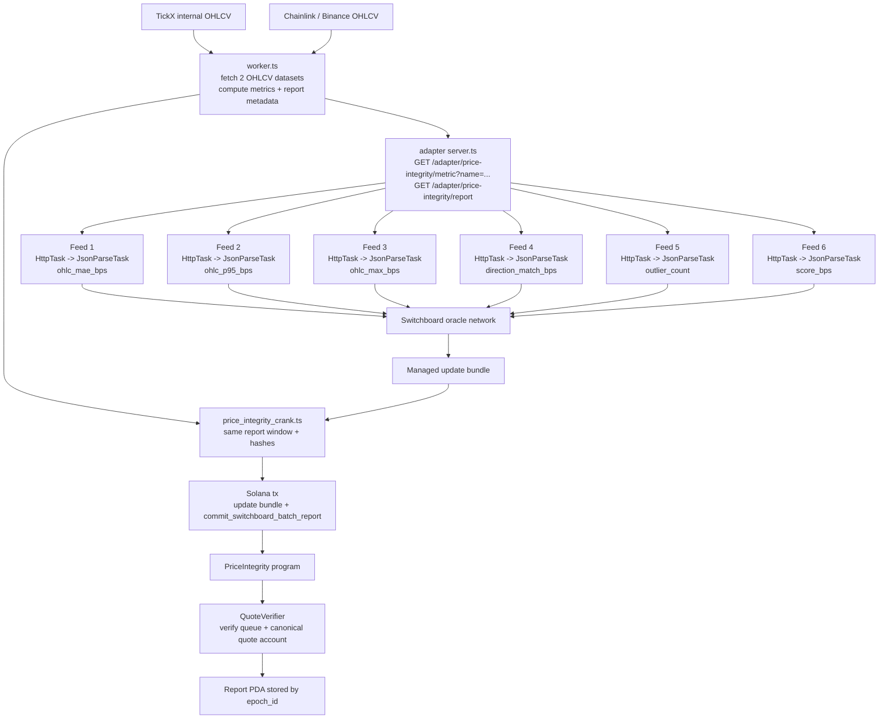

# TickX Reserve

`Rust` `Solana` `Switchboard` `TypeScript`

TickX Reserve is the onchain reserve and market-integrity layer for TickX.

Current submission scope:

- `PoolReserve`
- `PriceIntegrity`
- Switchboard-driven reporting flow for Solana `PriceIntegrity`

## Features

| Feature | Status | Notes |
|---|---|---|
| Solana native-SOL `PoolReserve` | ✅ Implemented | deposit + admin-signed claim only |
| Admin-signed trader claims | ✅ Implemented | claim path requires configured signer |
| Solana `PriceIntegrity` contract | ✅ Implemented | verifies Switchboard quote and stores report PDA |
| Switchboard HTTP-backed feeds | ✅ Implemented | 6 feeds, one per metric |
| Combined `update + commit` cranker | ✅ Implemented | one Solana tx per reporting window |

## Deployments

### Contracts

| Component | Network | Address / ID | Notes |
|---|---|---|---|
| `PoolReserve` program | Solana | `Bwwg2cPZzgij4GT795iBB882wFtRyuSr5qBrAYzyAoWT` | native-SOL reserve program |
| `PriceIntegrity` program | Solana | `DmSfDiv3fqsQ7UngRAKNkFUz7HGRZfSABMBs8GBm5ddH` | report storage + Switchboard verification |
| Switchboard queue | Solana devnet | `EYiAmGSdsQTuCw413V5BzaruWuCCSDgTPtBGvLkXHbe7` | default devnet queue |
| Switchboard quote program | Solana devnet | `orac1eFjzWL5R3RbbdMV68K9H6TaCVVcL6LjvQQWAbz` | canonical quote storage |
| `PriceIntegrity` quote account | Solana devnet | `HvYPSrVULJNaTR88QZX4KrVWoyWyUhVR3QxmhvvGLtE9` | derived from queue + ordered feed IDs |

### PriceIntegrity production feed IDs

Source of truth:
- [switchboard/deployments/price-integrity-prod-devnet.json](/Users/sniperman/code/tapfun-chainlink-sc/switchboard/deployments/price-integrity-prod-devnet.json)

| Metric | Feed ID |
|---|---|
| `ohlc_mae_bps` | `0x64567c678ec76087fcd7f08885b6ad30194e095332c935f652861ca943530f17` |
| `ohlc_p95_bps` | `0x61a693fb737ea8d22e7c2099713c3e0f78377bb8ad1d1a8037e531633f476ef7` |
| `ohlc_max_bps` | `0xd746c3d65f90d72518430fb7215dd75e37eb2b21b11eec89da44fc412ea6257d` |
| `direction_match_bps` | `0x7e8ebf352cf3d0609b86c0a09cf57a008e8580fd1cb4145088aa99c6d136d673` |
| `outlier_count` | `0x365edab4617773413b62a2b8d60f9a4fbeaa7a5e716a0599c19e0331e7164b83` |
| `score_bps` | `0x20c061424095ff1298c4370ce682314c2d35bf597b38d6f2345c704dbecaf833` |

## Architecture

### PoolReserve

- Solana `PoolReserve` is a native-SOL reserve program.
- Traders deposit lamports into the vault PDA.
- Trader claims require the configured admin signer.
- The production surface is `deposit + claim + owner signer management`.

### PriceIntegrity and Switchboard

There are two different responsibilities in this flow:

1. **Metric computation**
   - `switchboard/src/worker.ts` fetches OHLCV from two sides:
     - TickX internal OHLCV
     - Chainlink / Binance reference OHLCV
   - the worker compares both datasets and computes:
     - `ohlc_mae_bps`
     - `ohlc_p95_bps`
     - `ohlc_max_bps`
     - `direction_match_bps`
     - `outlier_count`
     - `score_bps`
   - the same worker also computes report metadata:
     - `epochId`
     - `windowStart`
     - `windowEnd`
     - `candleCount`
     - `internalCandlesHash`
     - `chainlinkCandlesHash`
     - `diffMerkleRoot`
   - if we use the current Switchboard feed design, we run `switchboard/src/server.ts` as an adapter service
   - that adapter converts raw OHLCV into the metric endpoints consumed by Switchboard jobs

2. **Oracle verification + onchain commit**
   - Switchboard jobs fetch the six scalar metrics from the public adapter endpoints exposed by `server.ts`
   - oracle network signs the bundle
   - our cranker sends one Solana transaction:
     - Switchboard managed update bundle
     - `commit_switchboard_batch_report`
   - the Solana contract verifies the canonical quote account via `QuoteVerifier`
   - then stores the report PDA keyed by `epoch_id`

### Offchain compute pipeline

Before Switchboard sees any metric, the repo computes it offchain in this order:

| Stage | Action | Result |
|---|---|---|
| 1 | Fetch OHLCV from TickX internal source | internal candle set |
| 2 | Fetch OHLCV from Chainlink / Binance reference source | reference candle set |
| 3 | Compare both OHLCV datasets in `worker.ts` | MAE / P95 / Max / direction / outliers / score |
| 4 | Publish derived metrics through adapter endpoints in `server.ts` | scalar metric endpoints for Switchboard |

### Switchboard feed task graph

Each production feed uses exactly this task pipeline:

| Feed | Task 1 | Task 2 | Output |
|---|---|---|---|
| `ohlc_mae_bps` | `HttpTask(GET /adapter/price-integrity/metric?name=ohlc_mae_bps)` | `JsonParseTask($.value)` | numeric bps |
| `ohlc_p95_bps` | `HttpTask(GET /adapter/price-integrity/metric?name=ohlc_p95_bps)` | `JsonParseTask($.value)` | numeric bps |
| `ohlc_max_bps` | `HttpTask(GET /adapter/price-integrity/metric?name=ohlc_max_bps)` | `JsonParseTask($.value)` | numeric bps |
| `direction_match_bps` | `HttpTask(GET /adapter/price-integrity/metric?name=direction_match_bps)` | `JsonParseTask($.value)` | numeric bps |
| `outlier_count` | `HttpTask(GET /adapter/price-integrity/metric?name=outlier_count)` | `JsonParseTask($.value)` | integer |
| `score_bps` | `HttpTask(GET /adapter/price-integrity/metric?name=score_bps)` | `JsonParseTask($.value)` | integer |

Important:

- there is **no** `ComparisonTask` inside Switchboard jobs
- there is **no** custom oracle-side computation graph for OHLC diffing
- all comparison logic happens in `worker.ts`
- the upstream TickX API only exposes OHLCV, not final integrity metrics
- `/adapter/price-integrity/...` is an adapter endpoint we host ourselves when using the current feed design
- Switchboard only transports the finalized metric scalars into a verified quote

### Detailed data flow



### Commit path into contract

`switchboard/src/price_integrity_crank.ts` does:

1. load the deployed feed config JSON
2. compute the current report snapshot from the real API
3. fetch `updateIx = queue.fetchUpdateBundleIx(...)`
4. build consumer ix for `commit_switchboard_batch_report`
5. send `asV0Tx([updateIx, commitIx])`

`sol-contracts/price-integrity/src/processor.rs` then:

1. checks configured `queue` and canonical `quote_account`
2. verifies the quote through `QuoteVerifier`
3. reads the six feed values in fixed order
4. recomputes `failure_flags` and `is_passed`
5. stores report state onchain

## Installation

### Solana PoolReserve

```bash
cd sol-contracts
cargo check
cargo build-sbf
```

### Solana PriceIntegrity

```bash
cd sol-contracts/price-integrity
cargo check --manifest-path client/Cargo.toml
cargo build-sbf
```

### Switchboard workflow

```bash
cd switchboard
npm install
```

## Scripts and runbooks

### PoolReserve deploy

```bash
cd sol-contracts
solana program deploy target/deploy/tickx_pool_reserve_sol.so
```

### PoolReserve initialize

```bash
cd sol-contracts
cargo run --manifest-path client/Cargo.toml --bin initialize -- \
  --rpc-url https://api.devnet.solana.com \
  --payer ~/.config/solana/id.json \
  --program-id <POOL_RESERVE_PROGRAM_ID> \
  --claim-signer <CLAIM_SIGNER_PUBKEY>
```

### PoolReserve deposit

```bash
cd sol-contracts
cargo run --manifest-path client/Cargo.toml --bin deposit -- \
  --rpc-url https://api.devnet.solana.com \
  --payer ~/.config/solana/id.json \
  --program-id <POOL_RESERVE_PROGRAM_ID> \
  --amount-sol 0.1
```

### PoolReserve claim

```bash
cd sol-contracts
cargo run --manifest-path client/Cargo.toml --bin claim -- \
  --rpc-url https://api.devnet.solana.com \
  --payer ~/.config/solana/id.json \
  --program-id <POOL_RESERVE_PROGRAM_ID> \
  --claim-signer ~/.config/solana/claim-signer.json \
  --trader <TRADER_PUBKEY> \
  --amount-sol 0.1
```

### Switchboard metrics server

```bash
cd switchboard
npm run server
```

### Switchboard job simulation

```bash
cd switchboard
npm run simulate
```

### Switchboard production feed deploy

```bash
cd switchboard
npm run deploy:prod:devnet
```

### Switchboard production crank

```bash
cd switchboard
npm run crank:devnet -- \
  --program-id <PRICE_INTEGRITY_PROGRAM_ID> \
  --rpc-url https://api.devnet.solana.com \
  --payer ~/.config/solana/id.json \
  --config-json /Users/sniperman/code/tapfun-chainlink-sc/switchboard/deployments/price-integrity-prod-devnet.json
```

### Convenience wrapper

```bash
PROGRAM_ID=<PRICE_INTEGRITY_PROGRAM_ID> \
/Users/sniperman/code/tapfun-chainlink-sc/scripts/run_price_integrity_commit.sh
```

### 15-minute cron

```cron
*/15 * * * * cd /Users/sniperman/code/tapfun-chainlink-sc/switchboard && npm run crank:devnet -- --program-id <PRICE_INTEGRITY_PROGRAM_ID> --rpc-url https://api.devnet.solana.com --payer ~/.config/solana/id.json --config-json /Users/sniperman/code/tapfun-chainlink-sc/switchboard/deployments/price-integrity-prod-devnet.json >> /tmp/price-integrity-crank.log 2>&1
```
