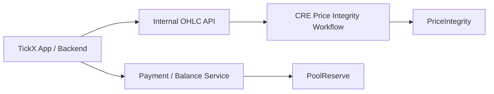

# TickX Reserve

Repository for the TickX onchain reserve layer and its CRE reporting workflow.

Current scope is intentionally narrow:

- `PoolReserve` for trader deposits, claims, and reserve custody
- `PriceIntegrity` for onchain storage of market-quality reports
- CRE workflow support for `PriceIntegrity`

Everything else in the product stack stays offchain.

## Scope

This repo is split into two active parts:

- [`contracts/`](./contracts) for the smart contracts and Foundry tests
- [`cre/`](./cre) for the Chainlink CRE workflow that submits `PriceIntegrity` reports



## Active Components

| Component | Role |
|---|---|
| `PoolReserve.sol` | Upgradeable ERC20 reserve for trader deposits, admin-signed claims, and Permit2 deposits |
| `PriceIntegrity.sol` | Receiver contract for storing batch comparison reports submitted via forwarder or direct call |
| `price-integrity/` | CRE workflow that fetches OHLC data, computes metrics, signs a report, and submits it onchain |

## Repository Structure

```text
.
├── contracts/
│   ├── src/
│   │   ├── PoolReserve.sol
│   │   ├── PoolReserveProxy.sol
│   │   ├── PriceIntegrity.sol
│   │   └── abstracts/ReceiverTemplate.sol
│   ├── script/
│   │   ├── DeployPoolReserve.s.sol
│   │   ├── UpgradePoolReserve.s.sol
│   │   └── DeployPriceIntegrity.s.sol
│   └── test/
├── cre/
│   ├── price-integrity/
│   ├── project.yaml
│   └── README.md
└── README.md
```

## Quick Start

### Smart contracts

```bash
cd contracts
forge build
forge test -vv
```

### CRE

```bash
cd cre
bun install
bun run build
cre workflow simulate price-integrity --target worldchain
```

## Deployment

### Deployed Contracts

World Chain mainnet:

| Contract | Address |
|---|---|
| `PoolReserve` | `0x6351b3006aAE72a36006614310928930Ac229d0e` |
| `PriceIntegrity` | `0xB9F60C92168cafA09eaA13302FD11896Cb773268` |

### Deploy PoolReserve

```bash
cd contracts
OWNER_ADDRESS=0x... \
ASSET_ADDRESS=0x... \
CLAIM_SIGNER_ADDRESS=0x... \
forge script script/DeployPoolReserve.s.sol:DeployPoolReserve \
  --rpc-url "$RPC_URL" \
  --private-key "$PRIVATE_KEY" \
  --broadcast
```

### Upgrade PoolReserve

```bash
cd contracts
POOL_RESERVE_PROXY_ADDRESS=0x... \
forge script script/UpgradePoolReserve.s.sol:UpgradePoolReserve \
  --rpc-url "$RPC_URL" \
  --private-key "$PRIVATE_KEY" \
  --broadcast
```

### Deploy PriceIntegrity

```bash
cd contracts
FORWARDER_ADDRESS=0x... \
forge script script/DeployPriceIntegrity.s.sol:DeployPriceIntegrity \
  --rpc-url "$RPC_URL" \
  --private-key "$PRIVATE_KEY" \
  --broadcast
```

## Notes

- Branding in this repo is now `TickX`.
- Some non-core files may still reflect earlier broader experiments, but the maintained path is `PoolReserve + PriceIntegrity`.
