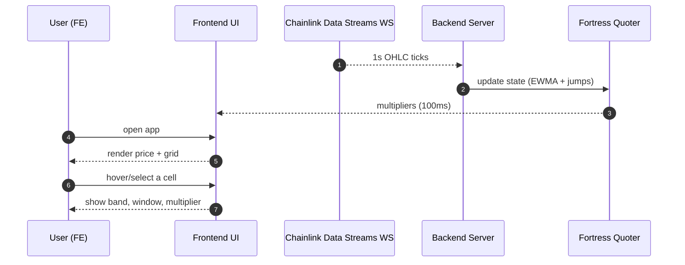
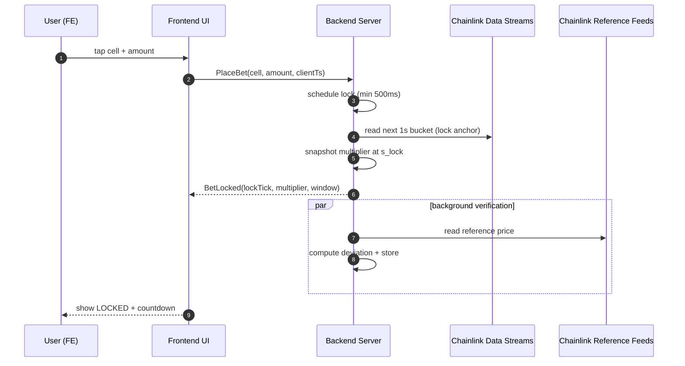
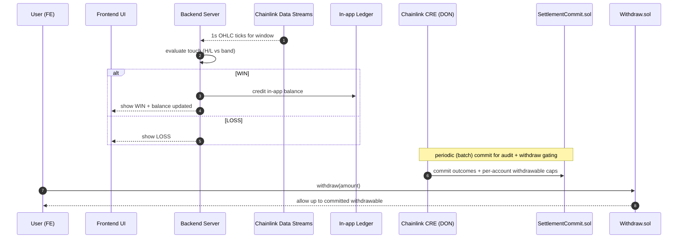
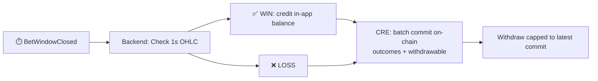
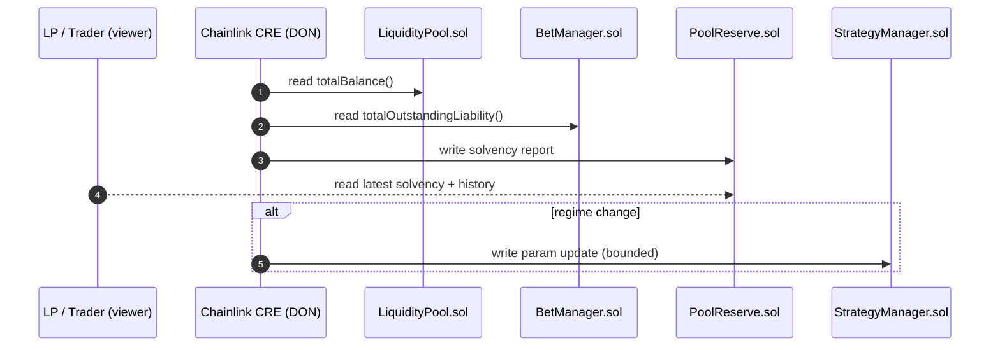
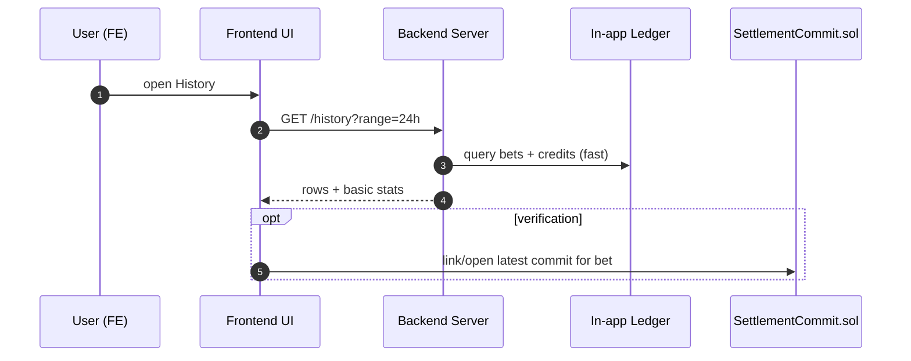
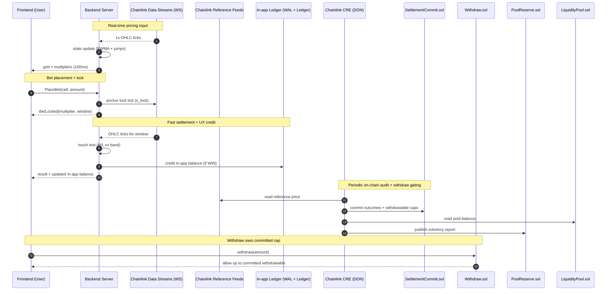

# Jobs to be Done

<aside>
🎯

**JTBD framework** — what users are *actually* trying to accomplish, not features

</aside>

---

## Core Job

> **When** I want to speculate on short-term crypto price movements, **I want to** make instant predictions with verifiable on-chain settlement, **so that** I can trade with high leverage without trusting a centralized platform.
> 

---

## User Stories

### 1. Predict — "Tap and win in 5 seconds"

*When I see the price grid, I want to tap a cell and place a bet instantly, so I can make fast predictions without complex forms.*

**Success criteria:**

- [ ]  Grid shows $20 bands × 5s windows with live multipliers
- [ ]  One tap = bet placed instantly (no modals)
- [ ]  Multiplier updates every second (Chainlink Data Streams)
- [ ]  Multiplier snapshots at lock (guaranteed payout rate)

*Emotional driver:* "I want instant dopamine and fast resolution, not waiting days for a trade to play out."

*Competitors:* Binance Options (30s min, complex margin UI) · Polymarket (event-based, days to resolve) · Perp DEXs (funding rates, liquidation risk, slow UX)

### 2. Trust — "Don't trust, verify"

*When I place a bet, I want proof that the price feed and settlement are fair, so I know the house isn't manipulating the outcome.*

**Success criteria:**

- [ ]  Settlement uses 1s OHLC candles from Chainlink Data Streams, verified on-chain
- [ ]  Price Integrity Proof published every 15 min (internal price vs Chainlink reference pricing)
- [ ]  Anyone can call `getLatestProof()`
- [ ]  All deviations in bps, transparently logged

*Emotional driver:* "Crypto casinos always cheat on the spread. I need mathematical proof they didn't."

*Competitors:* Rollbit (proprietary feed, no verification) · Stake (opaque pricing, no on-chain proof) · CEX perps (frequent "wicks," no recourse)

### 3. Settle — "Fast settle, safe withdraw"

*When my prediction is correct, I want my winnings credited instantly in-app, and I want withdrawals to be verifiable and solvent, so I get fast UX without trusting the house.*

**What runs where (so the story is unambiguous):**

- **Off-chain (backend hot path):** receive bet, lock multiplier, evaluate OHLC touch, credit in-app balance, write WAL + Ledger entries
- **On-chain (contracts):** custody pool funds, enforce withdraw gating, store settlement commits and attestations
- **CRE (Chainlink):** publish Price Integrity + Proof of Reserve, and batch-commit settlement results + per-account withdrawable caps to the on-chain commit contract

**Success criteria:**

- [ ]  Settlement checks each 1s OHLC candle in the window
- [ ]  If high/low touched the band → user wins
- [ ]  Winnings credited to in-app balance immediately
- [ ]  Settlement outcomes are batched and committed on-chain via CRE
- [ ]  Withdrawable balance is committed on-chain and withdrawals are capped to the latest committed amount
- [ ]  Commit contains enough fields to audit later: window id, oracle seconds, band, outcome, credited amount, and updated withdrawable cap
- [ ]  Zero manual claim process

*Emotional driver:* "I want instant feedback, but I also want proof the platform can pay."

*Competitors:* Traditional betting sites (slow withdrawals, KYC limits) · CEX options (withdraw limits) · Prediction markets (manual redemption after event)

### 4. Provide Liquidity — "Know my P&L, know my risk"

*As a liquidity provider, I want to see how my liquidity is performing (P&L, APR, drawdown) and how much risk I am taking, so I can size exposure and exit before a bad regime.*

**Success criteria:**

- [ ]  LP returns are transparently tied to trader outcomes (zero-sum)
- [ ]  LP is NOT guaranteed against losses (no “LP solvency guarantee”)
- [ ]  LP dashboard shows: current position value, P&L, net deposits/withdrawals
- [ ]  APR is computed from realized P&L over a rolling window (7d / 30d)
- [ ]  Risk metrics: utilization, max single-bet exposure, estimated tail loss (CVaR₉₉)
- [ ]  Fortress engine caps tail risk via CVaR₉₉ and skew reduces multipliers when exposure concentrates
- [ ]  CRE Proof of Reserve remains a public solvency signal for traders (not an LP guarantee)
- [ ]  CRE also publishes LP-relevant reports: pool P&L by epoch, utilization, and parameter changes (rebalance events)

*Emotional driver:* "I am fine taking house risk if I can measure it and exit fast."

*Competitors:* GLP (opaque risk) · AMM LPs (no explicit risk caps)

### 5. Track — "Just enough history"

*When I've placed multiple bets, I want a simple history view with outcomes and basic stats, so I can sanity-check results without building a full trading terminal.*

**Success criteria:**

- [ ]  History list: time, band, window, multiplier, outcome, credited amount
- [ ]  Basic stats: total bets, win rate, net P&L
- [ ]  Optional verify link to the latest settlement commit (when available)
- [ ]  No CSV export in sprint scope

*Emotional driver:* "I want clarity, not spreadsheets."

*Competitors:* CEX trade history (too complex) · Etherscan (raw tx, no context)

---

## User Personas

### Degen Dan — The High-Frequency Trader

- **Sessions:** 3–5×/day, $100–$500 per session, 20+ bets per session
- **Pain:** "DEX perps are too slow and the UI is bloated. I just want to bet on the next 10 seconds of BTC."
- **Core jobs:** Predict + Settle + Track
- **Willingness to pay:** High volume, accepts 3–5% house edge for speed and UX
- **Technical comfort:** Low to Medium — wants one-click UX, doesn't care about underlying infra as long as it pays out
- **Churn risk:** Leaves if settlement >10s or multipliers feel unfair vs. competitors

### LP Larry — The Yield Farmer

- **Positions:** $10K–$100K in liquidity pools, rebalances monthly
- **Pain:** "I want real yield from trading fees, but I'm terrified of protocol insolvency or exploit hacks."
- **Core jobs:** Provide Liquidity + Track (pool health)
- **Yield expectation:** 8–15% APY from trading fees, benchmarks against GLP/GMX
- **Technical comfort:** High — reads docs, checks Proof of Reserve, understands CVaR
- **Due diligence:** Reviews CRE Proof of Reserve weekly, tracks pool ratio, exits if ratio <1.3×

### Institutional Irene — Out of scope for this sprint

- This persona is intentionally not a target right now.
- If we mention institutions at all, it is only as a future path after the retail + LP loop is proven.
- Deferred items: multi-sig flows, institutional reporting, RBAC, compliance exports → Backlog P2

---

## User Flows

<aside>
🗺️

**Mid-level flows** for the dev team. Each maps to a User Story above.

</aside>

### Flow 1 · Discover & Select

**Story:** Predict · **Goal:** User opens app and evaluates potential bets

| **Step** | **What happens** | **Note** |
| --- | --- | --- |
| 1.1 | User opens app, views price grid | Render live BTC/USDT price + multiplier grid via 100ms LERP |
| 1.2 | Volatility Engine sends EWMA + Hawkes metrics to Fortress Quoter | Risk & Quoting pipeline active |
| 1.3 | Fortress Quoter computes live multipliers for all $20 bands | Calculated based on current vol and pool exposure |
| 1.4 | User selects $20 band & 5s window | Highlight selected cell, show potential payout |

⚠️ If WebSocket connection drops, UI must freeze grid to prevent stale bet placement.

### Flow 2 · Execute & Lock

**Story:** Predict + Trust · **Goal:** User places bet and system locks immutable state

| **Step** | **What happens** | **Note** |
| --- | --- | --- |
| 2.1 | User taps cell (One-touch bet) | Frontend sends User ID, Band, Window, Amount to Backend |
| 2.2 | System locks bet at next oracle tick | Lock within ≤500ms. Snapshot the multiplier to Chainlink Data Feeds |
| 2.3 | Price Integrity Proof runs (every 15 min) | Compare [Tap.fun](http://Tap.fun) vs Binance vs Chainlink, publish proof |
| 2.4 | If deviation > 50bps, proof published with `withinTolerance = false` | Full transparency, system alerts on anomalies |
| 2.5 | Bet confirmation pushed — tx hash, locked multiplier, window start/end | Toast notification + bet card appears in sidebar |
| 2.6 | Frontend transitions to "Watch" state with live countdown | Grid cell pulses, countdown overlay starts |

⚠️ High latency during 2.2 → lock price drifts from tapped price. Target ≤500ms. If >1s, show "Slow lock" warning + cancel option before window opens.

### Flow 3 · Watch & Settle

**Story:** Settle · **Goal:** Window closes, resolve result fast, then commit on-chain for audit + withdrawals

| **Step** | **What happens** | **Note** |
| --- | --- | --- |
| 3.1 | User observes countdown & price movement | Frontend streams OHLC ticks visually |
| 3.2 | Backend settles bet result off-chain (fast) | Uses 1s OHLC touch logic for the window |
| 3.3 | Winnings credited to in-app balance | No on-chain transfer at this moment |
| 3.4 | CRE batches and commits settlements on-chain | Includes outcomes + updated withdrawable per account |
| 3.5 | User can withdraw up to latest committed withdrawable amount | Any additional wins wait for the next commit |
| 3.6 | History updates and links to commits for verification | UI shows settlement event + the commit reference when available |

⚠️ If a commit is delayed, UI shows "Pending commit" and disables withdrawing above the last committed amount.

### Flow 4 · Pool Reserve & Rebalance

**Story:** Provide Liquidity · **Goal:** Verify solvency and adjust risk parameters automatically

| **Step** | **What happens** | **Note** |
| --- | --- | --- |
| 4.1 | CRE runs Proof of Reserve (every 60s) | Verify pool balance > liability (ratio > 1.5x) |
| 4.2 | CRE evaluates `VolRegimeChange` events | Triggered when volatility jumps |
| 4.3 | Strategy Rebalance CRE workflow auto-adjusts Fortress params | Caps max multipliers, increases skew to protect LP funds |
| 4.4 | LP yield distributed automatically via Chainlink CRE + CCIP | Cross-chain distribution on `EpochEnded` |

⚠️ Vol regime shift mid-epoch → Fortress params may lag up to 60s. During gap, multipliers may overshoot — Skew guard caps exposure at 2× normal max.

### Flow 5 · Track (Minimal)

**Story:** Track · **Goal:** User sees simple history + basic stats (feature is secondary)

| **Step** | **What happens** | **Note** |
| --- | --- | --- |
| 5.1 | User opens History | Default: last 24h |
| 5.2 | Backend loads history from internal ledger first | Shows credited amounts immediately; commit reference can appear later |
| 5.3 | Each row: band, window, multiplier, outcome, credited amount | Keep it scannable |
| 5.4 | Basic stats | Total bets, win rate, net P&L |
| 5.5 | Optional verification | Link to latest on-chain settlement commit (if present) |

⚠️ If commit is pending, show "Pending commit" but do not block viewing history.

---

## Data Flow — Full System (Touchpoints)

---

## Switch Triggers

<aside>
💡

**What makes someone switch to [Tap.fun](http://Tap.fun)?**

</aside>

1. **Tired of slow perp DEXs** — wants instant 5s resolution instead of managing margin and funding rates
2. **Burned by opaque pricing** — lost money to sudden "wicks" on centralized platforms, wants verifiable Chainlink settlement.
3. **Seeking higher leverage** — wants 100x multipliers without managing collateral health.
4. **Frictionless UX** — wants one-touch betting without signing multiple wallet transactions per trade.
5. **Got liquidated on perps** — lost position to a wick or cascade, wants fixed-risk bets with no liquidation.
6. **Saw a win on CT** — social proof from Crypto Twitter clips showing instant payouts → curiosity → first bet.